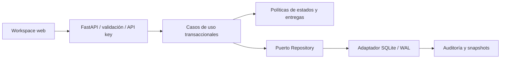

# Delivery Assurance Platform

[](https://github.com/jorgefprietol/delivery-assurance-platform/actions/workflows/ci.yml)

Plataforma de ingeniería para controlar la calidad de una entrega desde sus requisitos hasta la evidencia de aceptación. Combina una API REST, un workspace web, persistencia transaccional y publicación automatizada de imágenes OCI.

**Autor:** Jorge Prieto · **Tipo de trabajo:** proyecto independiente de ingeniería de software.

## Problema que resuelve

Una entrega puede parecer completa aunque existan requisitos sin verificar, pruebas que ya no corresponden al alcance actual o riesgos críticos sin respuesta. La plataforma hace explícitas esas condiciones y bloquea el registro de una versión hasta resolverlas. Cada versión conserva su propia instantánea y una huella SHA-256 para comprobar cambios en el contenido exportado.

## Capacidades

- Proyectos con responsable, alcance y requisitos funcionales y no funcionales.
- Flujo `draft → approved → implemented → verified`; la verificación exige una evidencia aprobada.
- Criterios de aceptación, prioridades, revisión de requisitos e invalidación de evidencia anterior.
- Registro de pruebas unitarias, de integración, sistema y aceptación, con resultados positivos y negativos.
- Matriz de riesgos 5 × 5: riesgos abiertos con puntuación ≥ 15 bloquean la entrega.
- Control de concurrencia mediante versiones y HTTP 409 ante actualizaciones obsoletas.
- Historial de cambios y versiones inmutables desde la aplicación y protegidas por triggers SQLite.
- Interfaz responsive sin dependencias de frontend, exportación de evidencia JSON y contrato OpenAPI.

## Arquitectura



El dominio no importa FastAPI ni SQLite. El servicio depende de un puerto, y el adaptador de persistencia confirma datos, evidencia y auditoría en una misma transacción. Se utiliza un monolito modular porque las reglas requieren consistencia y el alcance actual no justifica servicios distribuidos.

## Ejecutar con Docker

```powershell
git clone https://github.com/jorgefprietol/delivery-assurance-platform.git
cd delivery-assurance-platform
./scripts/setup.ps1
docker compose up -d --build --wait
```

Abre **http://127.0.0.1:18130** e introduce el valor `API_KEY` de tu archivo local `.env`. La credencial se mantiene en memoria en el navegador. El contenedor ejecuta UID 10001, filesystem de solo lectura, capabilities eliminadas y límites de recursos; SQLite se conserva en un volumen. La configuración vincula el puerto a loopback.

En Linux/macOS:

```bash
printf 'API_KEY=%s\nAPP_PORT=18130\n' "$(openssl rand -hex 32)" > .env
docker compose up -d --build --wait
```

## Desarrollo y verificación

Requiere Python 3.12. Los locks fijan dependencias directas y transitivas.

```powershell
python -m venv .venv
./.venv/Scripts/python.exe -m pip install -r requirements-dev.lock
./.venv/Scripts/python.exe -m ruff check app tests scripts
./.venv/Scripts/python.exe -m ruff format --check app tests scripts
./.venv/Scripts/python.exe -m pytest
```

Para probar el contenedor por HTTP y crear un proyecto de datos sintéticos:

```powershell
$env:API_KEY = ((Get-Content .env | Where-Object { $_ -like 'API_KEY=*' }) -split '=', 2)[1]
./.venv/Scripts/python.exe -m scripts.smoke
```

El smoke test comprueba autenticación, transiciones, conflictos de versión, evidencia, bloqueo por riesgos, registro de entrega y auditoría. Genera `artifacts/smoke-release.json`. Las pruebas producen JUnit y cobertura XML; CI exige al menos 90 % de cobertura del backend.

## Pipeline y distribución

GitHub Actions ejecuta lint, formato, pruebas, auditoría de dependencias, construcción del contenedor, aceptación HTTP y comprobación de persistencia tras reiniciar. Solo después publica en **GHCR** con etiquetas por commit y `latest` o versión, SBOM y procedencia de construcción. Las Actions y la imagen base están fijadas por SHA/digest. Las PR ejecutan validación sin permisos de publicación.

El pipeline publica una imagen; el despliegue a un servidor externo se configura según su entorno. El workspace local se ejecuta con Docker Compose.

## Documentación de ingeniería

| Documento                                        | Contenido                                        |
| ------------------------------------------------ | ------------------------------------------------ |
| [Especificación](docs/requirements.md)           | Alcance, casos de uso, requisitos y trazabilidad |
| [Arquitectura](docs/architecture.md)             | UML, datos, estados, SOLID y decisiones          |
| [Plan de calidad](docs/quality-plan.md)          | Estrategia de pruebas, métricas y controles      |
| [Riesgos y evolución](docs/risks-and-roadmap.md) | Riesgos, entrega incremental y deuda técnica     |
| [Operación](docs/runbook.md)                     | Configuración, recuperación y distribución       |
| [Experiencia de proyecto](docs/portfolio.md)     | Descripción verificable para portafolio y CV     |

## Alcance actual

Workspace de un equipo con credencial compartida; sin RBAC ni identidades individuales. La evidencia es registrada por operadores: no ejecuta pruebas de proyectos externos ni certifica automáticamente sus resultados. La huella detecta modificaciones del contenido, pero no es una firma digital. La protección SQLite no impide que un administrador con acceso al volumen altere la base. El despliegue actual es de una instancia; la disponibilidad, la carga y la usabilidad aún requieren medición en un entorno objetivo.

## Referencias técnicas

- [FastAPI: contenedores](https://fastapi.tiangolo.com/deployment/docker/)
- [GitHub: publicación de imágenes](https://docs.github.com/en/actions/tutorials/publish-packages/publish-docker-images)
- [Docker: SBOM y procedencia en Actions](https://docs.docker.com/build/ci/github-actions/attestations/)

Licencia MIT.
