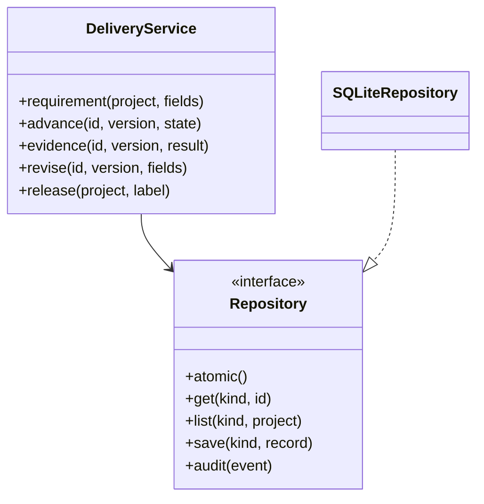
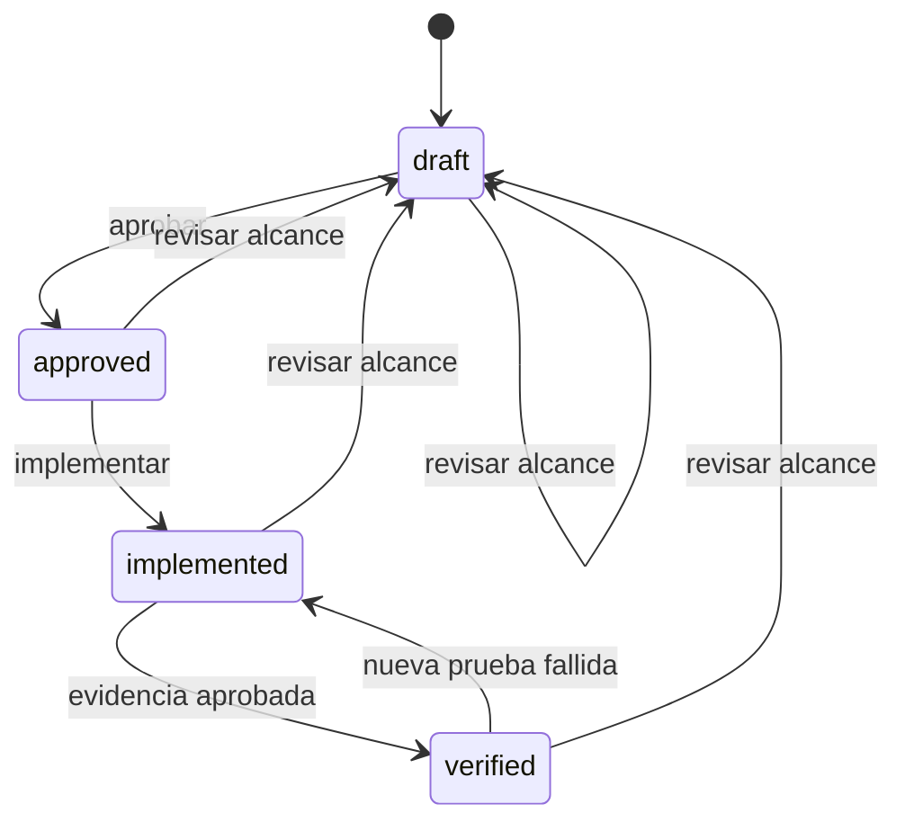
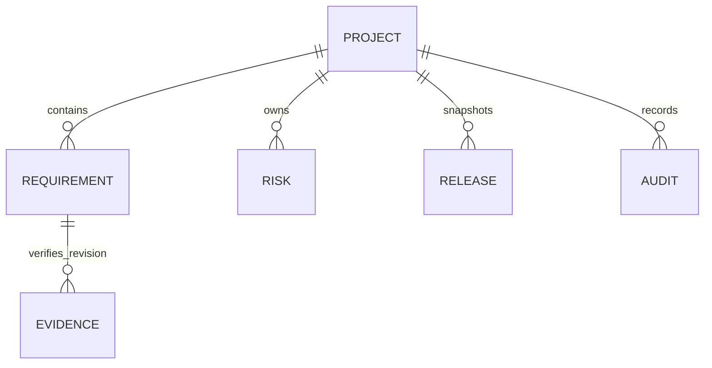

# Arquitectura y decisiones

## Estructura y responsabilidades

`domain.py`: políticas puras de transición, preparación, SHA de commit y huellas. `auth.py`: registro de sujetos autenticados y reglas de rol. `service.py`: casos de uso y transacciones. `ports.py`: contrato de persistencia. `storage.py`: SQLite, migración y auditoría. `main.py`: HTTP, validación y autorización. `static/`: interfaz sin framework, construida con elementos DOM y texto seguro.

SOLID se aplica con responsabilidades separadas, dependencia del servicio hacia un protocolo pequeño y adaptador intercambiable. No se agregan jerarquías de clases sin necesidad. La cohesión de los casos de uso permite revisar las reglas junto con las pruebas de aceptación.

Cada implementación guarda `implementation_sha` y `implemented_by`. Cada evidencia referencia la revisión y el commit exactos; un SHA distinto se rechaza en la misma transacción, sin crear registros parciales. Aprobar, verificar y registrar una entrega exige el rol `reviewer`; crear, revisar alcance, implementar y mitigar exige `engineer`. La revisión y autorización comprueban también que el sujeto sea distinto al implementador, incluso si un usuario cambia de rol entre operaciones.

Revisar un requisito incrementa `revision` y `version` y elimina sus atribuciones de aprobación, implementación y verificación. La evidencia histórica se conserva. El estado verificado solo puede originarse en evidencia aprobada para la revisión y el SHA vigentes. Una nueva evidencia fallida elimina ese estado. La entrega exporta `source_commits` y el sujeto aprobador.

## Modelo de datos

Persistencia física: `records(kind,id,project_id,body)` y `audit(sequence,project_id,body)`. Índice por tipo y proyecto. Los JSON almacenados se validan por SQLite. La integridad referencial se aplica dentro de los casos de uso; no hay borrado de entidades ni interfaz de escritura directa a las tablas. `schema_version` controla la migración transaccional 1 → 2: requisitos anteriores sin atribución/SHA vuelven a borrador con nueva revisión y evento de migración. Las entregas, evidencias y auditoría históricas permanecen intactas; la migración no inventa autorías ni commits. Se verifica su idempotencia y conservación de snapshots.

## ADR-001: monolito modular

Decisión: un proceso HTTP y un núcleo transaccional. Motivo: mantener alcance, evidencia, gate y auditoría consistentes sin coordinación distribuida. Consecuencia: escalamiento vertical y una instancia inicialmente; separar servicios requeriría una necesidad medida.

## ADR-002: SQLite con WAL

Decisión: WAL y `BEGIN IMMEDIATE` para serializar cambios y crear snapshots consistentes. Dos operadores con la misma versión producen un éxito y un conflicto. Consecuencia: bloqueo de escrituras y límite práctico de una instancia; para múltiples réplicas se debe adaptar el puerto a PostgreSQL y conservar semántica transaccional.

## ADR-003: snapshots históricos

Decisión: copiar proyecto, requisitos, riesgos, evidencia y gate al registrar una versión. Triggers impiden editar o eliminar versiones y auditoría mediante operaciones SQL normales. SHA-256 se calcula sobre JSON ordenado y compacto. Consecuencia: historial ocupa espacio; la huella no reemplaza una firma ni un almacenamiento externo a prueba de administradores.

## ADR-004: interfaz y seguridad

Decisión: frontend servido en el mismo origen, sin HTML interpolado desde datos, scripts externos ni almacenamiento persistente de credenciales. El registro de credenciales del servidor vincula cada clave a un sujeto estable y un rol; las entradas de cliente no pueden suplantarlos. CSP y validación limitan las entradas. Consecuencia: administración de credenciales por el operador del despliegue; OIDC y MFA son una evolución para integrar identidades corporativas. La separación técnica de cuentas no acredita que dos personas diferentes custodien las claves.
